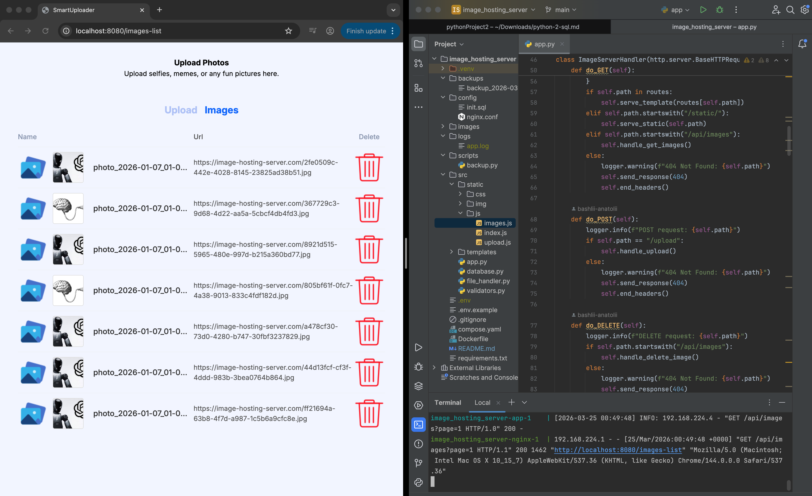

# 🌉 Image_hosting_server
Web server for downloading recording and storing images.
Created without using frameworks.




---

## 🚀 Features

- **Homepage (`/`)**
  - Welcome message and service description
  - Links to:
    - Image upload page (`/upload`)
    - Uploaded images catalog (`/images/`)

- **Image Upload (`/upload`)**
  - Supported formats: `.jpg`, `.png`, `.gif`
  - Maximum file size: 5 MB
  - Generates a unique filename for each upload
  - Saves images to the `/images` folder
  - Returns a direct link to the uploaded image

- **Access Uploaded Images (`/images/<filename>`)**
  - Images are served efficiently via Nginx

- **Logging**
  - All user actions are stored in `app.log`

---

## ⚙️ Technologies

- **Programming language:** Python 3.12 (`http.server`)
- **Static file server:** Nginx
- **Containerization:** Docker + Docker Compose
- **Python libraries:** `Pillow` (image handling), standard library (`http.server`, `os`, `logging`, `json`)
- **Frontend:** HTML/CSS/JS (optional)


---

##  📶 Installation and start

Clone the repository:

```
cd image_hostting_server
git clone <repository-url>
```

Create and activate a virtual environment:

```
python -m venv venv
source venv/bin/activate  # On Windows: venv\Scripts\activate
```

Install dependencies:

```bash
pip install -r requirements.txt
python src/app.py
```

Create a `.env` file in the project root and add your data:

```
DB_HOST=your-host
DB_NAME=your-name
DB_USER=your-user
DB_PASSWORD=your-password
DB_PORT=your-port

PORT=server-port

POSTGRES_DB=DB_NAME
POSTGRES_USER=DB_USER
POSTGRES_PASSWORD=DB_PASSWORD
```
Start the project:

```bash
docker compose up --build
```

This command will build the Docker images and start both the backend and Nginx services.

To stop the running containers, use:

```bash
docker compose down
```

---

## 🔒 Validation

- Only accepts `.jpg`, `.png`, `.gif`
- Maximum file size: 5 MB
- Access only via `/images/<filename>`
- Nginx protects direct filesystem access


---

## 📄 Application Pages

| URL | Description |
|-----|-------------|
| `/` | Home page |
| `/upload` | Image upload page |
| `/images-list` | Image gallery |
| `/api/images` | API endpoint returning list of images in JSON |

---
## 🗂️ Structure project
```
image_hosting_server
├── .env.example         # Example environment variables
├── .gitignore           # Git ignore file
├── README.md            # This file
├── requirements.txt     # Project dependencies
├── Dockerfile            # Dockerfile for backend
├── docker-compose.yml    # Docker Compose configuration
├── config/
│    ├── init.sql         # Database initialization script
│    └── nginx.conf       # Nginx configuration
├── images/               # Volume for uploaded images
├── logs/                 # Volume for logs
├── backups/              # Database backups
└── src/
    ├── app.py            # Server 
    ├── database.py       # Database connection and queries
    ├── validators.py     # File validation logic
    ├── file_handler.py   # File processing and saving
    ├── static/           # Optional static files (CSS/JS)
    └── templates/        # HTML templates for frontend pages 
        ├── images.html   # Image gallery page
        ├── index.html    # Home page
        └── upload.html   # Upload page
```

---

## 🏗 Architecture

- **Python backend**
  - Handles `/` and `/upload`
  - Validates files, generates unique filenames, saves images, logs actions
  - Runs on port `8000` inside the container

- **Nginx**
  - Serves static files from `/images/`
  - Proxies other requests to the Python backend
  - Available to users on port `8080`

- **Docker Compose**
  - Two services: `app` (Python) and `nginx`???
  - Two volumes: `images` and `logs`

---

## 💾 Database Backup

```bash
# Create a backup
python scripts/backup.py create

# List backups
python scripts/backup.py list

# Restore from a backup
python scripts/backup.py restore <name_backup>.sql